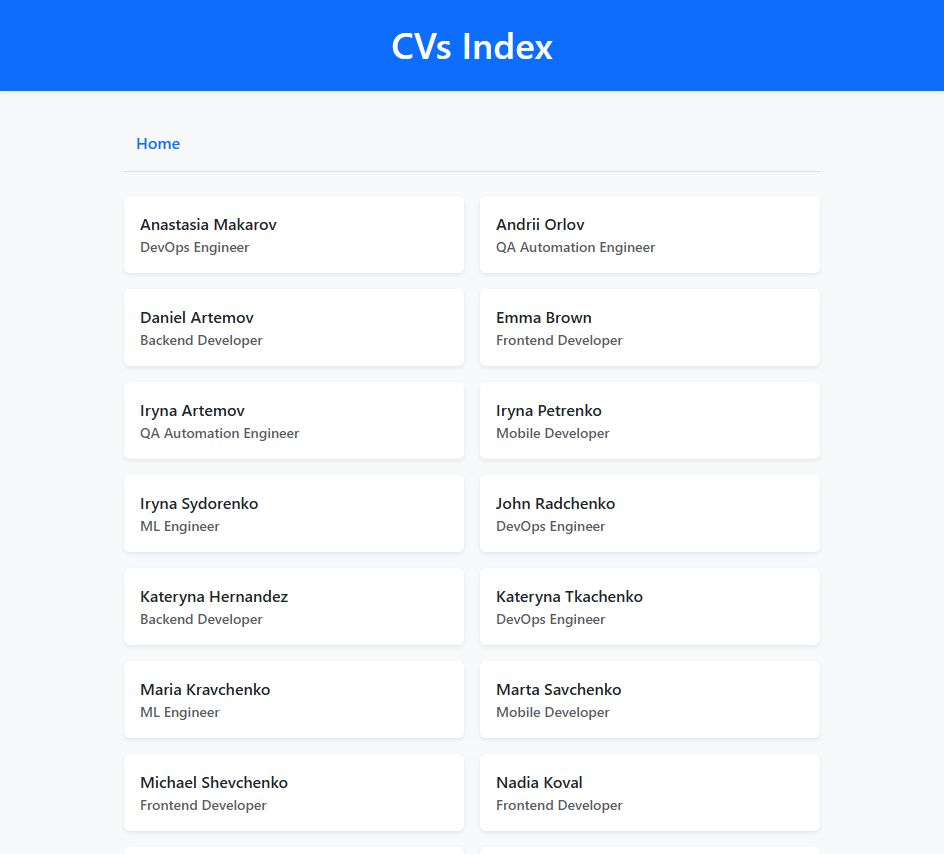
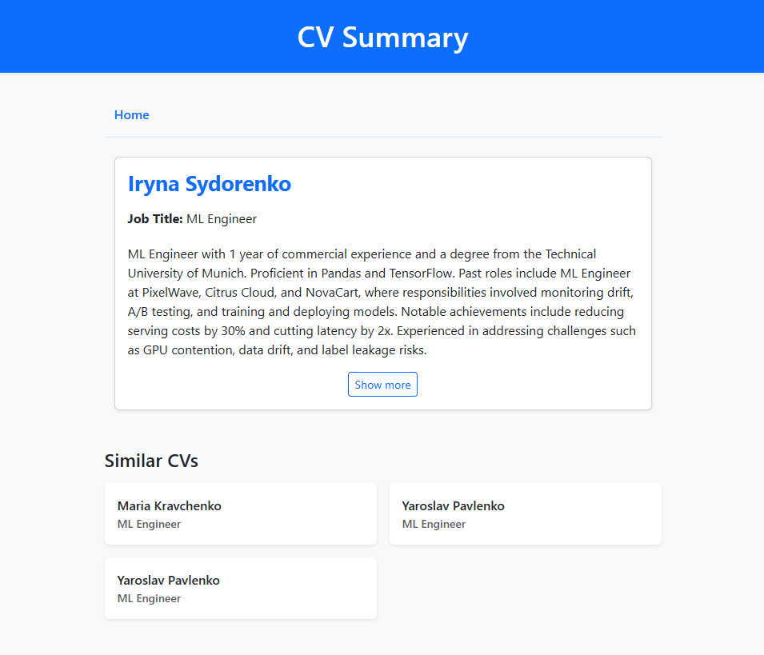
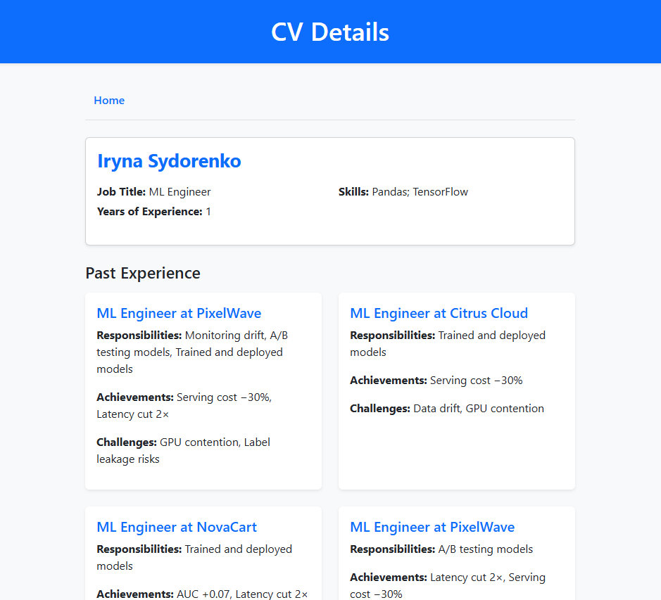
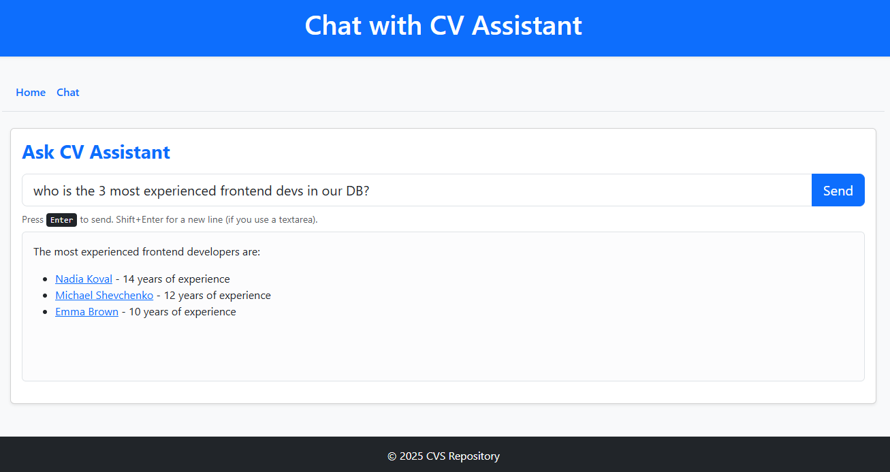
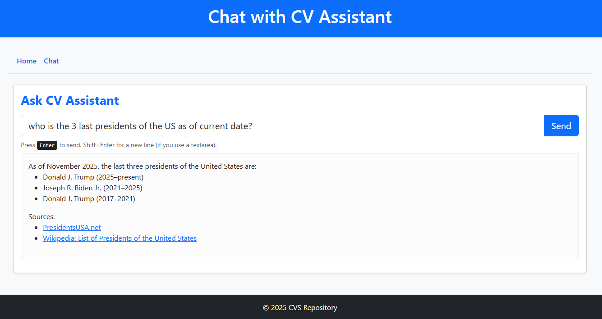

# CVs Assistant (Django + LlamaIndex + Chroma)

An AI‑powered Django app that lists resumes (CVs), lets you open any candidate to see an **AI‑generated summary**, and provides a **“Show more”** view with full details. At the bottom of the summary/details page, the app shows **up to 4 related (similar) resumes** selected via **vector similarity search** backed by **Chroma** and **LlamaIndex**.

---

## Features

- **Home page** lists all resumes.
- **Candidate page** shows an AI-generated summary and a “Show more” view with full details.
- **Related resumes**: up to 4 similar CVs are displayed, retrieved by vector similarity search (Chroma + LlamaIndex).
- **Two custom Django manage commands**:
  - `import_cvs`: Import CVs from a CSV into the database.
  - `ingest_cvs`: Ingest DB CVs into a **persistent** Chroma collection for search.

---
## UI overview

### Home page

Home page with the list of all candidates, sorted by name



### Candidate page with AI summary and related resumes

Candidate's summary page showing AI-generated summary and related resumes



### Candidate page with full details

Candidate's full details page showing all CV information and related resumes

Candidate's past experience is generated by the LLM from unstructured raw string into a structured JSON array which can be directly plugged in into a django template



### Ask AI Page

The **Ask AI** page serves as an interactive interface where users can ask the AI assistant questions — either about the available CV data or about general topics beyond the local database.  

This page is powered by the **LlamaIndex ReAct (Reasoning + Acting)** agent — a powerful framework that allows the AI to reason through complex problems, decide what external tools or data sources to use, and then act accordingly to produce accurate, context-aware answers.

The ReAct agent combines two key capabilities:
- **Reasoning** – breaking down a query into logical steps to understand what information is needed and how to obtain it.  
- **Acting** – executing specific actions such as querying a database, running a tool, or searching the web to gather that information.

For CV-related questions, the agent integrates with a **Chroma vector database**, which stores embeddings of all CVs. It retrieves the most relevant entries based on semantic similarity and uses them to generate a well-informed response.



When users ask **general knowledge questions**, the agent automatically switches to using the **Tavily Web Search tool** to find and summarize the most relevant information from the Internet.  

Additionally, the agent employs a **Current Date tool** that provides real-time awareness of the current date, ensuring that it can fetch up-to-date web results instead of relying solely on its static training knowledge.



In summary, the Ask AI page demonstrates how reasoning-driven, tool-augmented AI can dynamically combine **retrieval from local data (CVs)** with **external web knowledge**, delivering accurate, context-aware, and current responses.

---

## Prerequisites

- Python 3.11+ (recommended)
- [uv](https://github.com/astral-sh/uv) for virtualenv + dependency management
- A working **SQLite/PostgreSQL/MySQL** (SQLite is fine for local dev)
- An **OpenAI API key** for LlamaIndex (set `OPENAI_API_KEY`)

---

## 1) Create a virtual environment (with `uv`)

```bash
# From the project root
uv venv .venv
# (On Windows PowerShell)
# .venv\Scripts\Activate.ps1
# (On bash/zsh)
source .venv/bin/activate
```

If your project uses `pyproject.toml` with `uv`, you can directly use `uv sync` (see next section).

---

## 2) Install dependencies

If you have a **pyproject.toml**:
```bash
uv sync
```

If you have a **requirements.txt**:
```bash
uv pip install -r requirements.txt
```

---

## 3) Environment variables

Create a `.env` file in the project root:

```dotenv
# Required for LlamaIndex/OpenAI
OPENAI_API_KEY=sk-...

# Where Chroma stores its persistent collection (folder will be created if missing)
CHROMA_PERSIST_DIR=.chroma

# Optional: how many similar results to retrieve by default
LLM_INDEX_SIM_TOP_K=4

# Standard Django settings you may already have
DJANGO_SETTINGS_MODULE=project.settings
```

> Ensure your Django `settings.py` reads `CHROMA_PERSIST_DIR` (e.g., via `os.environ.get("CHROMA_PERSIST_DIR", ".chroma")`).

---

## 4) Apply migrations and load the app

```bash
python manage.py migrate
python manage.py createsuperuser  # optional
```

---

## 5) Import DB data from `resumes.csv`

Place your CSV (headers must match exactly) in the project root or provide an absolute path.

**Required headers** (exact spelling):  
`Name, Job Title, Years of Experience, Skills, Education, Past experience`

Run the import command:

```bash
python manage.py import_cvs resumes.csv   --batch-size 500   --encoding utf-8-sig
```

Notes:
- `--batch-size` (default 500) controls how many rows are inserted in a batch.
- `--encoding` defaults to `utf-8-sig` which works well with Excel exports.

> After import, check the admin or homepage to see records.

---

## 6) Ingest DB data into a **persistent** Chroma vector store

Once CVs are in the DB, build the vector index so similarity search works:

```bash
# Build (or rebuild) a collection named "cvs"
python manage.py ingest_cvs --collection cvs --rebuild
```
- `--collection` defaults to `cvs`.
- `--rebuild` (optional) will drop/recreate the collection.

This:
1) Converts each CV row to a plain‑text document with useful metadata (id, name, job title, years, etc.).  
2) Uses OpenAI embeddings via LlamaIndex.  
3) Writes to a **persistent** Chroma store at `CHROMA_PERSIST_DIR`.

---

## 7) Start the Django development server

```bash
python manage.py runserver
```

Open http://127.0.0.1:8000/ in your browser.

---

## How it works (high level)

- **Data model**: `JobTitle` and `CV` tables with fields for name, title, years, skills, education, and past experience.
- **Import**: The `import_cvs` command reads the CSV, upserts job titles, and bulk‑inserts CVs.
- **Ingestion**: The `ingest_cvs` command pulls CVs from the DB, converts each to a LlamaIndex `Document`, and indexes them into a **Chroma** persistent collection using **OpenAI embeddings** (`text-embedding-3-small` by default).
- **Query**: The app uses LlamaIndex to query the Chroma vector store and retrieve similar resumes for the “Related resumes” block.
- **Views & URLs**:
  - `/` — home page with CV list.
  - `/id/summary/` — AI summary for a CV.
  - `/id/` — full details + related resumes.

---

## CSV Format Example

```csv
Name,Job Title,Years of Experience,Skills,Education,Past experience
Jane Doe,Backend Engineer,5,"Python;Django;PostgreSQL","BS Computer Science","Acme Inc: Backend dev; Contoso: Platform team"
John Smith,DevOps Engineer,7,"Docker;Kubernetes;AWS","MS Software Engineering","OrbitSoft: SRE; GreenPixel: DevOps"
```

> Use `;` to separate multiple skills/education entries if desired.

---

## Troubleshooting

- **No CVs found during ingestion**  
  Make sure you ran the import step and have records in the DB.
- **OpenAI key issues**  
  Ensure `OPENAI_API_KEY` is set in `.env` and your shell session sees it.
- **Chroma not persisting**  
  Verify that `CHROMA_PERSIST_DIR` points to a writeable folder.

---

## Useful dev commands

```bash
# Rebuild the Chroma collection from scratch
python manage.py ingest_cvs --collection cvs --rebuild

# Import a specific CSV with a different encoding
python manage.py import_cvs ./data/resumes.csv --encoding windows-1251
```
